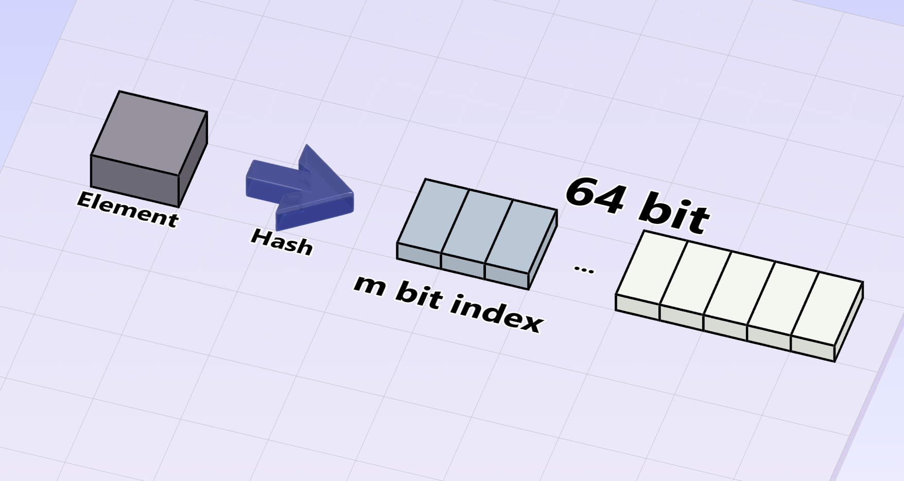

## 前言

今天要來介紹一個酷酷的東西  
就是我們這篇的主角 **HyperLogLog**   
在請他出場之前我們先來介紹計數問題  
如果我們今天要在一堆元素中算出有幾個不同的元素，你會怎麼做？   
<!-- truncate -->
最無腦的解法就是直接使用程式語言內建的集合一個一個塞進去  
但這個做法只適合小量的資料  
當今天資料量上到一定的程度時內建的集合就會吃掉巨量的記憶體   
那今天如果我可以允許一點誤差呢？  
像是網站統計人數不一定要做到完全精確  
抓個估計值即可，這就是我們 **HyperLogLog** 出場的時候  
讓我們歡迎他🙌🙌

## 概念
HyperLogLog 是一種透過機率來估計一個基數的資料結構  
同時使用非常少的資料量，完美符合我們的需求，耶   
那我們先介紹他的核心原理: **機率小的事情不容易發生**  
換句話說，當一個機率小的事情發生時  
我們很有可能已經有大量的基數了  
舉例大樂透如果中獎機率是 1%  
當你抽到時就會覺得是 100 個人中最幸運的  
當然有可能多個人同時中獎，而且具體幾個人抽是不知道    
但是直觀上參加抽獎的人數是一個接近 100 的數  
而 Hyperloglog 是透過隨機數開頭有幾個連續的 0 來表示發生的機率  
比方說開頭有連續三個 0 發生的機率應該是 1/8
### 新增元素
那講完核心原理後我們來看看他是怎麼運作的吧！  
剛才提到隨機數，我們可以透過雜湊想紀錄的元素來得到一個隨機數  
底下列出一些我們會使用到的變數
* `m`: 代表雜湊值的前 `m` 位 bits  
* `registers`: 一個大小為 $2^m$ 次方的 array，初始值皆為 `0`

而他提供的操作主要有兩個，一個是加入，另一個是估算基數  
在我們要加入新的元素進去時  
我們會先將要加入的元素 hash 成一個 64 bits 的數字  
並取出他的前 `m` 個 bits 當成索引，用來尋找對應的 register  
接著我們就會用剩下的 `(64 - m)` bits 最前面有幾個連續的 `0` 來更新對應的 register  
但若對應的 register 原本的值更大就不更新     
可以看下圖來更明白一點  
藍色的部分用來找對應 register，剩下的部分用來更新 register


:::info 舉例
我們今天假設一開始的 `m` 設定為 `2`  
並且原先 Hyperloglog 裡面並沒有儲存任何東西  
那因為 `m` 是 `2`，所以我們需要 `4` 個 register  
當我們今天新增 `hi` 這個元素時    
假設 `hi` 的 hash 為 `10001.......` (二進位)  
我們先取出他的前兩個 bits `10`，對應的數字是 `2`  
代表我們要更新第三個 register  
而更新的值為 `2`，因為後面的 `62` 個 bits 開頭有 `2` 個連續的 `0`  
但若對應 register 原本的值就大於 `2` 則不更新
:::

我們可以看到 Hyperloglog 藉由儲存目前出現最多連續的 0 的來估算基數  
那這邊就會有另外一個問題了，為什麼需要很多個 register 呢？  
我直接把全部 bits 都拿來用不好嗎 ？  
這個問題我們在下面說明～

### 計算基數
有了元素之後下一步就是來估算 HyperLogLog 裡面到底有多少元素  
那公式的話如下
$\alpha$ 為修正係數，在 [Redis 的實作](https://github.com/redis/redis/blob/unstable/src/hyperloglog.c#L368C1-L368C47)中採用的是 `0.72134` ( $\frac{1}{2ln2}$ )  
這個值的具體由來可能需要參考原論文，我也不清楚 XD  
而 `m` 的含義與上一節提到的 `m` 相同  
$$
Cardinality = \alpha \times m \times \frac{m}{\sum^m_{i = 1} 2 ^{-Register[i]}}
$$

看到這邊你可能會非常矇逼，兩個 `m` 尬麻不乘一起變成 $m^2$  
下面那一坨又是什麼？
不急，我們先來介紹一種平均法

### 調和平均
我們一般最常見的平均就是全部相加再除以總個數，這種平均稱為算術平均數  
比如說我跟郭台銘的財產平均就是我們兩個的財產相加 $\div$ 2  
但因為郭台銘太有錢了，所以你會發現這個平均幾乎等於郭台銘的財產 $\div$ 2  
這就是算術平均數的問題，容易因為極端的值而得到沒有什麼意義的結果。  
今天我們的 HyperLogLog 其實也有這種問題  
我們想藉由最多有幾個連續的 0 來估算基數  
但有沒有可能在運氣爆棚的情況下第一次就得到超多的 0  
導致我們嚴重高估我們的基數  
在原本的論文中使用調和平均數來降低這種影響  
如果今天有 `n` 個值，公式如下   
$
\frac{n}{\frac{1}{m_1} + \dots + \frac{1}{m_n}}
$

:::info 舉例
如果今天我有 `10` 塊，郭台銘有 `10`萬塊  
那我們的調和平均就是 $\frac{2}{\frac{1}{10} + \frac{1}{100000}} = 19.998$   
:::

### Back to 基數
有了上面的公式後，再看看計算基數的步驟  
最後那一項很噁心的值不就是對所有計數器中的值求調和平均嗎？  
會與 `2` 的次方有關是因為我們是二進位，連續的 `n` 個 `0` 出現的機率是 $2^{-n}$  
那調和平均前面的那個 `m` 意義就是平均 $\times$ 個數 $=$ 總和  
最後再做我不懂的修正得到我們想要的基數  
現在我們知道為什麼要有很多 register 而不是一個值來存連續的 0 的最大值  
因為這樣透過後面調和平均減少極端影響  


## 動動手
搞了這麼久讓我們寫點扣玩玩看吧！  
為求快速寫的有點醜..  
最開始當然是宣告一個 class  
還有我們想要的 registers 個數 (由 `m` 控制)  
bitmask 是我們為方便求 register 的 index，他的二進位就是 `m` 個 `1`
```py
#!/usr/bin/python3

import math
import uuid

class HyperLogLog:

    constant = 0.72134

    def __init__(self, m_bits) -> None:
        self.m_bits = m_bits
        self.registers = [0] * (1 << m_bits)
        self.register_bitmask = (1 << m_bits) - 1
```
    
接下來就是我們的 hash function!  
藉由 % 抓出最後的 `64` 位  
但要注意的是 python 的 hash 若是丟入數字  
會原封不動的吐回你傳入的數字  
所以這個範例請不要無腦用小數字來實驗，否則得到的 hash 會不平均  


```py
    @classmethod
    def hash(cls, data) -> int:
        # get last 64 bits
        return hash(data) % (1 << 64)
```
下一步就是找出有幾個連續的 `0`  
其實就是找出第一個 `1`  
但要注意是從左邊第 `m+1` 個 bit 開始  
前面的是要當成 register index  
那怎麼知道某一位是不是 `1` 呢  
我們可以用左位移來做出一個 `00100...0` (二進位) 的值  
那個 1 的位置就是我們想確認的位置，搭配 & 就可以知道了！
```py
    def first_1_bit_position(self, hash_val)->int:
        """
        the structure of hash_val's bits: [m_bits, 64 - m_bits]
        find the first 1 position lies in the right part (64 - m_bits)
        """
        
        
        # from left to right
        for bit_pos in range(self.m_bits, 64):
        
            bit_mask = (1 << (64 - bit_pos - 1))
            
            if hash_val & bit_mask:
                return bit_pos - self.m_bits + 1

        return 64 - self.m_bits
```
我們還需要知道某個 hash 對應的 register 是哪個  
這也很簡單，因為我們有一開始初始化的 bitmask 了  
只要抓出前 `m` 個 bits & 一下就知道結果了！  
抓出前 `m` 個 bits 最簡單的方式就是直接右位移 >>
```py
    def get_register_index(self, hash_val): 

        return (hash_val >> (64 - self.m_bits)) & self.register_bitmask
```
快結束了！！ 我們的第一個操作 `add_element`  
做的事情也很簡單
hash 完，找出對應的 register，更新
```py
    def add_element(self, obj):
        hash_val = hash(obj)
        
        register_index = self.get_register_index(hash_val)

        self.registers[register_index] = max(self.registers[register_index], self.first_1_bit_position(hash_val))
```
最後一步，套公式🥳  
我們可以用 python 的 sum 以及 list comprehension 來取代醜醜的迴圈
```py
    def get_cardinality(self):
        harmonic_mean = len(self.registers) / sum(pow(2, -register) for register in self.registers)
        
        return math.floor(harmonic_mean * len(self.registers) * self.constant)
```


有興趣的可以複製下面的扣去玩 😵‍💫
<details>

<summary>Code</summary>


```py title="hyperloglog.py"
#!/usr/bin/python3

import math
import uuid

class HyperLogLog:

    constant = 0.72134

    def __init__(self, m_bits) -> None:
        self.m_bits = m_bits
        self.registers = [0] * (1 << m_bits)
        self.register_bitmask = (1 << m_bits) - 1 

    

    @classmethod
    def hash(cls, data) -> int:
        return hash(data) % (1 << 64)
        

    def first_1_bit_position(self, hash_val)->int:
        """
        the structure of hash_val's bits: [m_bits, 64 - m_bits]
        find the first 1 position lies in the right part (64 - m_bits)
        """
        
        
        # from left to right
        for bit_pos in range(self.m_bits, 64):
        
            bit_mask = (1 << (64 - bit_pos - 1))
            
            if hash_val & bit_mask:
                return bit_pos - self.m_bits + 1

        return 64 - self.m_bits
    
    def get_register_index(self, hash_val): 
        return (hash_val >> (64 - self.m_bits)) & self.register_bitmask
        
    def add_element(self, obj):
        hash_val = hash(obj)
        
        register_index = self.get_register_index(hash_val)

        self.registers[register_index] = max(self.registers[register_index], self.first_1_bit_position(hash_val))
    
    def get_cardinality(self):
        harmonic_mean = len(self.registers) / sum(pow(2, -register) for register in self.registers)
        
        return math.floor(harmonic_mean * len(self.registers) * self.constant)
    


cardinality = 10 ** 7

if __name__ == "__main__":
    hll = HyperLogLog(14)
    for i in range(cardinality):
        hll.add_element(str(uuid.uuid4()))
    print(hll.get_cardinality())
```

</details>


## Reference
* [HyperLogLog](https://algo.inria.fr/flajolet/Publications/FlFuGaMe07.pdf)