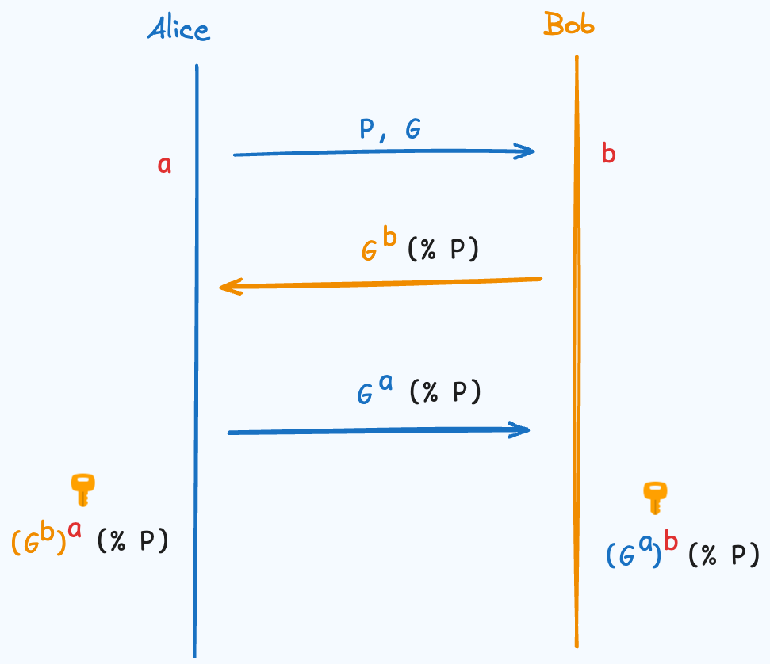

## 前言
前陣子公司的聊天頻道因為「效能」問題所以要把加密功能關掉    
也就是大家都可以被共司竊聽，人心惶惶  
今天要來介紹一個即時被竊聽仍然能算出共同密鑰的演算法！

## Diffie-Hellman
我們先從 Diffie-Hellman 的流程開始  
其實非常簡單，可以用下面這張圖概括  
Alice 與 Bob 想要決定一個共享的密鑰  
而這個過程即使有人竊聽也沒關係   
首先 Alice 先向 Bob 傳遞一個大質數 `P`，以及一個生成元 `G`  
關於生成元會在下面解釋  
接著 Alice 跟 Bob 分別產生一個隨機的數字 `a` 與 `b`  
這兩個數字需要保密  
Alice 向 Bob 告知 $G^a (mod \: P)$   
Bob 向 Alice 告知 $G^b (mod \: P)$  
接著他們分別把得到的數字做自己保密數字的次方即可得到相同的結果  
$(G^a)^b = G^{ab} = (G^b)^a$

## 生成元
上面的整個過程非常簡單  
那我們來介紹生成元是什麼  
但因為篇幅有限，我也不是什麼數學大師  
就用一個 mod 5 的整數乘法群為例子  
這個群裡面有 `{1, 2, 3, 4}`  
裡面任意兩數相乘再 mod 5 後仍在這個群內  
而我們如果觀察以下會發現  
$2^1=2$  
$2^2=4$  
$2^3=3$  
$2^4=1$  
$2^5=2$  
2 的冪次方可以遍歷這整個集合，我們稱 2 為這個群的生成元  

那為什麼需要生成元呢？  
因為生成元可以使得 $G^a$ 和 $G^b$ 的可能覆蓋整個集合  
讓暴力破解的難度較大  
而在 mod P 的情況下透過 $G^a$ 或 $G^b$ 尋找 `a`, `b` 的問題則稱為離散對數  

## 結尾
Diffie-Hellman 是透過離散對數問題的難度來保證他的安全性  
然而他也有其他變體像是 ECDH 
也就是把離散對數問題改成橢圓曲線  
只是 Diffie-Hellman 只能保證竊聽安全  
不保證中間人攻擊等等
如果你還是沒有很懂這個流程  
可以看看維基百科的這張圖  
下面這張圖假設已知基底是黃色  
但從 Public transport 的顏色很難還原出 Secret Colours

## Reference
* [Diffie-Hellman wiki](https://zh.wikipedia.org/zh-tw/%E8%BF%AA%E8%8F%B2-%E8%B5%AB%E7%88%BE%E6%9B%BC%E5%AF%86%E9%91%B0%E4%BA%A4%E6%8F%9B)