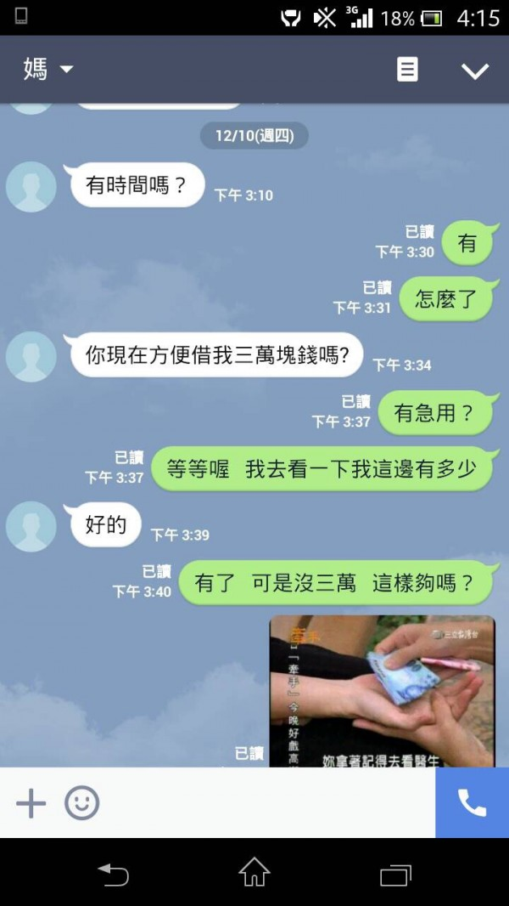
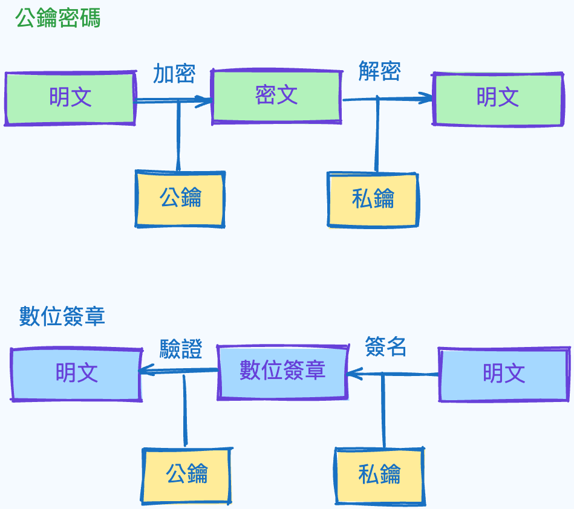
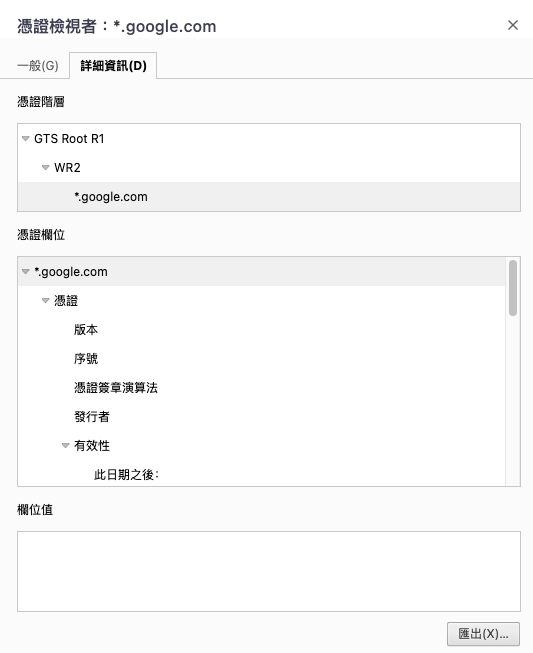

## 前言
很久以前在弄 final project 時給自己搞了個網域  
在弄憑證時搞得焦頭爛額因為完全不懂 (密碼學都白學)  
所以今天回來理解一下憑證到底是什麼，gogo٩(˃̶͈̀௰˂̶͈́)و  


## 在嗎，可以借我三萬塊嗎
在理解憑證之前我們需要先知道數位簽章是什麼  
前陣子很多人的哀居被盜  
就會看到以下對話 (截自網路)  
甚至還有自己的寵物帳被盜跑來跟自己借錢的  
  

其實有兩個可能 ( 寵物帳被盜另當別論 )  
1. 這是詐騙集團
2. 這是本人，只是他可以謊稱被盜來耍賴     


這兩個問題的根本原因其實是我們不能確認對方的身份  
當然如果今天在 2024 哀居開個視訊錄個影就能解決上述問題  
但在電腦的世界裡沒有這麼簡單  
而數位簽章就是來解決上述問題的一個工具  

## 數位簽章

數位簽章就是要解決確認身份的問題    
那我們要確認一個人最簡單的方式就是他說出一件只有他知道的事情  
這其實很像在公鑰密碼裡面  
我們可以透過公鑰加密訊息，只有私鑰才能解密   
只是今天是反過來我必須向你證明我有我的私鑰  
所以我們可以把公鑰密碼反過來使用  
使用私鑰加密，只有公鑰才能解密  
如果今天我能使用你的公鑰正確解密，就相信你確實擁有私鑰  
如果覺得很難懂，可以想像 `2 x 5 ` 跟 `5 x 2` 結果是一樣的  
用 2 加密就能用 5 解密，用 5 加密就能用 2 解密  
以下這張圖簡單的描述了兩者差別 (圖片概念來自圖解密碼技術)  


## 證書  

在講完了數位簽章後，那我們就可以進到證書的部分！  
證書是數位簽章最好的一個實際應用  
在我們瀏覽網頁時，我們會向該網域發出請求  
在我們建立安全的連線之前，可能會有反派角色來偽裝或竄改  
因此我們需要 server 端向我們證明他就是 server 本人  
而這個證明就是透過證書  
但這個過程有點複雜  
在我們實際講解之前可以用一個生動一點的例子來描述這個過程  

### 你是哪裡人？
想像今天有人詢問我的出生地  
那我們如何怎麼證明我說的是真的呢？  
當然就是拿出我們的身分證之類的  
雖然這可能是偽造的  
但上面會有標註說是哪個縣市蓋章核發的  
今天對方就可以去該縣市區公所詢問這身分證到底是不是真的  
但這邊會有一個問題，我怎麼知道區公所是真的區公所？  
假的區公所也可以說那是真的，這時候就變成跟一開始一樣的情況  
區公所必須向你證明他們真的是區公所，有上面市政府的蓋章     
於是乎你又又去市政府詢問，但市政府又必須證明他們是市政府    
如此反覆直到遇到一個夠大的官像是總統沒人可以幫他證明  

### 信任鏈  
上述的過程稱為信任鏈，就是透過層層的確認來建立信任的關係  
而最後你到底相不相信眼前的人取決於總統  
總統說不，前面的都全盤不相信  
總統說好，前面的人通通相信  
而實際情況中，例子中的我就是 server  
必須向對方證明我的身份   
而那些政府機關實際上稱為憑證認證機構 (CA)   
蓋的章也就是數位簽名  
最上層的稱為 Root CA   
但這邊你可能會有一些疑問  
* #### 世界上這麼多組織，如果該組織最後的 Root CA 我不認識怎麼辦？   
  不認識的話通常瀏覽器都會跳警告，你也可以自行匯入 Root CA 讓瀏覽器相信  
* #### 我一開始是怎麼認識那些 Root CA 的？  
  這是一個好問題，因為如果最後一關是冒牌貨那前面都白費了，因此現在的作業系統預設都會有
* #### 為什麼需要這些政府機構，而不是直接由 Root CA 認證？
  Root CA 的數量不多，如果要幫所有需要的人簽名會累壞

### 再深一點
前面講了一些概念，但沒有實際的東西非常空虛：（   
我們玩真的，直接看看網站的憑證  
今天如果用 terminal 可以輸入下面指令獲取 google.com 的憑證 
```sh
$ openssl s_client -showcerts -connect google.com:443  
```
就會出現類似底下的輸出
只是會有 3 次，因為有 3 層  
```
Connecting to 142.250.196.206
CONNECTED(00000005)
depth=2 C=US, O=Google Trust Services LLC, CN=GTS Root R1
verify return:1
depth=1 C=US, O=Google Trust Services, CN=WR2
verify return:1
depth=0 CN=*.google.com
verify return:1
---
Certificate chain
 0 s:CN=*.google.com
   i:C=US, O=Google Trust Services, CN=WR2
   a:PKEY: id-ecPublicKey, 256 (bit); sigalg: RSA-SHA256
   v:NotBefore: Aug 26 06:33:47 2024 GMT; NotAfter: Nov 18 06:33:46 2024 GMT
-----BEGIN CERTIFICATE-----
MIIOCzCCDPOgAwIBAgIRAOZwzD+jTewjEAGJW3l4SCUwDQYJKoZIhvcNAQELBQAw
OzELMAkGA1UEBhMCVVMxHjAcBgNVBAoTFUdvb2dsZSBUcnVzdCBTZXJ2aWNlczEM
```

看這個可能會看到中風，我們其實可以直接用瀏覽器檢視憑證  
應該是網址前的鎖頭會有憑證檢視的按鈕
  

在這邊我們很清楚的可以看到有三層，其實就是三張證書  
最下層的就是 google.com 這個網域的證書  
這個證書裡面包含了 google.com 的公鑰，以及上層 CA 對這張證書以及公鑰的 hash 的簽名    
使用 hash 是因為 hash 能當成證書以及公鑰的指紋，較有效率   
有了這個證書就能證明這個公鑰確實來自 google.com  
就能大膽地使用它跟 google.com 加密連線  

#### panic
那今天如果有人篡改證書  
把其中一部分換成他想要的值會發生什麼事呢？  
如果他惡意的換掉證書的某些部分  
在數位簽章驗證的過程會發現我們的 hash 與數位簽章的結果不符  
就可以得知中間過程有出現問題  


