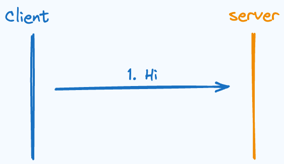
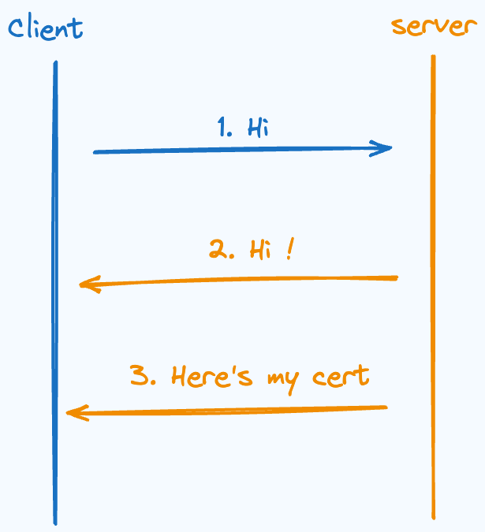
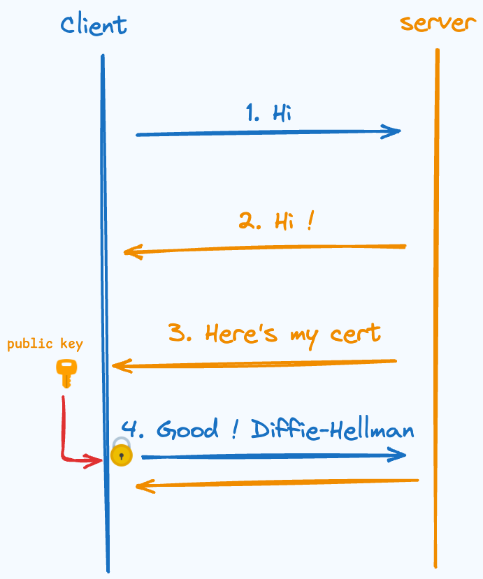
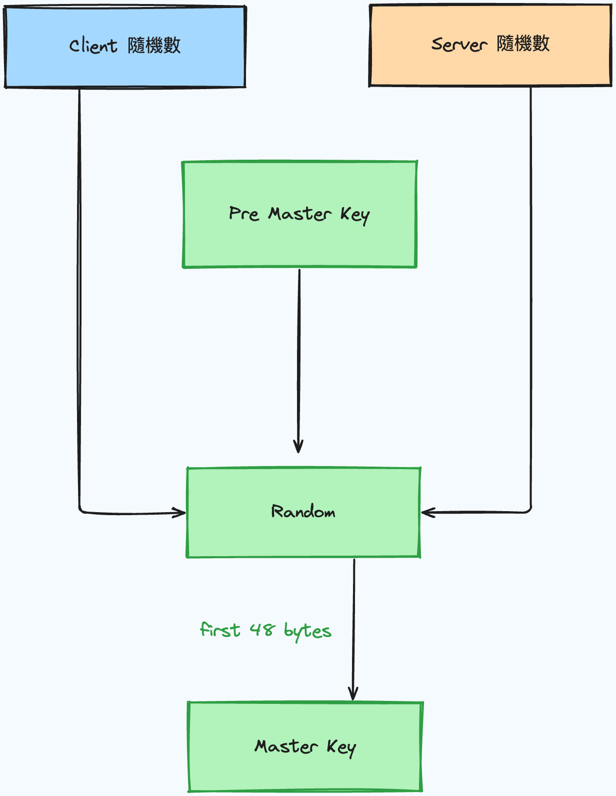

## 前言
每次瀏覽網頁時  
心裡其實都有點好奇  
我們的安全連線到底是如何建立的   
先簡單介紹一下 ssl/tls 是什麼  
netscape 在 1994 年設計了一款主要用於 web 的安全協定稱為 ssl (secure socket layer)  
用來加密自身的 HTTPS  
後來標準化後稱為 tls (transport layer security)  
那他們的工作非常辛苦  
要在不安全的環境下協議出一把對稱的密鑰來加密  
以保證之間的對話不會被竊聽甚至竄改  

在開始這趟旅程之前建議知道以下  
* Diffie-Hellman   
* 數位簽章與證書  


那我們以下說明的流程是 tls 1.2 的 Diffie-Hellman 版本  
因為 RSA 版本已經在 tls 1.3 版本被棄用  
那就讓我們開始吧！  

## 流程
具體步驟如下
1. **哈囉你好嗎**  
   一切都起源於 Client 的一句問候，在問候的時候會順便附上以下
   *  Client 上的 tls/ssl 支援的演算法等等  
      因為大家的版本不一定相同   
      所以要協商具體使用的演算法，如何雜湊加解密等等
   *  Client 隨機數  
      在後面會用到，可以用來抵禦重放攻擊    
    
2. **I'm fine, thank you.**  
   Server 聽到了 Client 的 Hi，也回應了 Hi，其中包含以下  
   * Server 決定使用的演算法
   * Server 隨機數，後面會用到

3. **I am me.**  
   Server 在這時將自己的憑證傳給 Client  
   證明自己就是 Server，在證書中有自己的公鑰  

   

4. **Diffie-Hellman!**  
   Client 在檢查完憑證後確認就是這個人  
   從這步開始就可以加密了  
   因為所有訊息都能透過 Server 公鑰加密    
   但是使用 RSA 這類非對稱加密的效能不好   
   所以需要另外一把 key 當成對稱密碼 (兩邊使用的密碼一樣)  
   便將 Diffie-Hellman 的參數透過 Server 的公鑰加密傳遞  
   而我們最後想要的這把對稱密碼稱為**主密碼 Master Key**  
   負責這次對話後續的所有加解密  

   但我們實際上 Diffie-Hellman 產生的共用密碼稱為**預備主密碼 ( Pre Master Key )**     
   而不是最後的主密碼  
   這是為了讓不同的演算法有一個一致性   
   最後會有圖片來解釋所有密碼的產生   

   :::tip 動動腦
    看到這邊你可能會有一個疑問  
    為什麼不將 Pre Master Key 直接透過公鑰加密傳送給 Server  
    而是在透過一層 Diffie-Hellman 密鑰交換  
    事實上這大致就是被棄用的 RSA 方法做的事情，那為什麼呢？  
   :::
    

5. **Almost Done...**  
   透過 Diffie Hellman 的步驟  
   Client 跟 Server 可以共同算出 Pre Master Secret  
   最後一步則是計算出 Master Secret  
   [RFC](https://datatracker.ietf.org/doc/html/rfc5246#section-8.1) 在這步有說明所有演算法最後的計算方式是一致的  
   也就是把兩個隨機數以及 Pre Master Secret 丟入偽隨機器  
   並取前 48 Bytes，下面這張圖是描述密碼的關係圖   
   

6. **Finished, cheers!**  
   雙方得到了 Master Key 後，就使用它加密 Finished 訊息傳送給對方  
   而這個 Finished 訊息包含了前面所有訊息的雜湊 (HMAC)  
   如果雙方收到後驗算發現不對  
   就可以大喊一聲：「有內鬼！終止交易！」

## 實地考察
講了這麼多，好累  
但沒有實地考察怎麼可以呢！
我們一樣是使用 tls1.2 來實地考察  
使用以下指令就可以觀察跟 Google.com 建立安全連線的過程！  
```sh
openssl s_client -connect google.com:443 -state -tls1_
```
以下就是輸出
仔細觀察可以看到一開始的 client hello 以及 server hello  
接下來就是 Google 的證書以及 Diffie-Hellman 的 key exchange  
最後 read finished 檢查無誤！   
cipher 的部分也能看到 ECDHE  
也就是使用橢圓曲線的 Diffie-Hellman Exchange  
那我們今天就到這邊了!  
明天還要上班 = =
```shell
Connecting to 172.217.163.46
CONNECTED(00000005)
SSL_connect:before SSL initialization
SSL_connect:SSLv3/TLS write client hello
SSL_connect:SSLv3/TLS write client hello
SSL_connect:SSLv3/TLS read server hello
depth=2 C=US, O=Google Trust Services LLC, CN=GTS Root R1
verify return:1
depth=1 C=US, O=Google Trust Services, CN=WR2
verify return:1
depth=0 CN=*.google.com
verify return:1
SSL_connect:SSLv3/TLS read server certificate
SSL_connect:SSLv3/TLS read server key exchange
SSL_connect:SSLv3/TLS read server done
SSL_connect:SSLv3/TLS write client key exchange
SSL_connect:SSLv3/TLS write change cipher spec
SSL_connect:SSLv3/TLS write finished
SSL_connect:SSLv3/TLS write finished
SSL_connect:SSLv3/TLS read server session ticket
SSL_connect:SSLv3/TLS read change cipher spec
SSL_connect:SSLv3/TLS read finished
....

SSL-Session:
    Protocol  : TLSv1.2
    Cipher    : ECDHE-ECDSA-CHACHA20-POLY1305
    Session-ID: 8CF6FD6E752A6B4DE7AAE2E09513B91E855CABB7D401274FBE9316E6591B0138
    Session-ID-ctx:
    Master-Key: $(你還想偷看我的密鑰喔?)
    PSK identity: None
    PSK identity hint: None
    SRP username: None
    TLS session ticket lifetime hint: 100800 (seconds)
    TLS session ticket:
```
